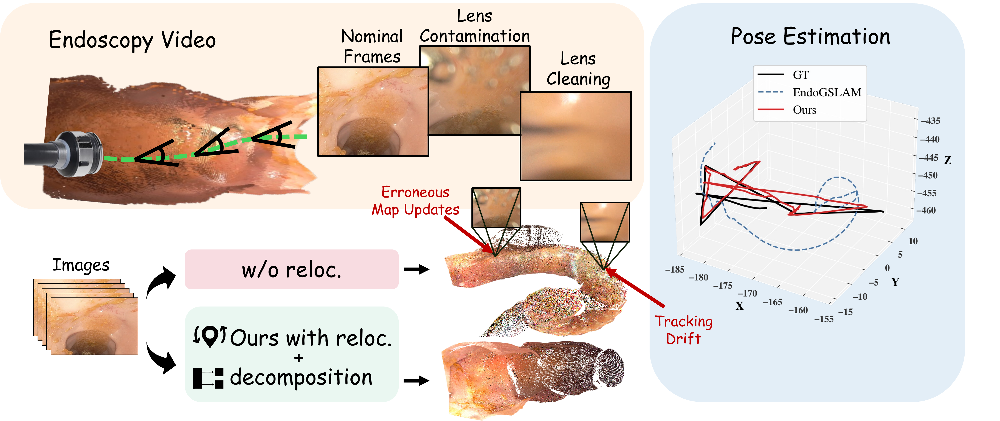

<div align="center">

# EndoMD-SLAM: Endoscopic Gaussian Splatting SLAM under Optical Degradation with Memory and Static-Transient Decomposition

<p>
  <a href="https://endomd-slam.github.io/"></a>
  
  <a href="https://drive.google.com/open?id=1ZIwVBhG1EkHJU3KLyrnnIYYK-rTmUfuO"></a>
</p>

<p>
  <b>Nuo Chen</b><sup>1*</sup>,
  <b>Kangqi Ni</b><sup>2*</sup>,
  <b>Lulin Liu</b><sup>1,3</sup>,
  <b>Joga Ivatury</b><sup>4</sup>,
  <b>Ying Ding</b><sup>4</sup>,
  <b>Farshid Alambeigi</b><sup>4</sup>,
  <b>Tianlong Chen</b><sup>2</sup>,
  <b>Zhiwen Fan</b><sup>1</sup>
  <br>
  <sup>1</sup>Texas A&amp;M University &nbsp;&nbsp;
  <sup>2</sup>UNC Chapel Hill &nbsp;&nbsp;
  <sup>3</sup>University of Minnesota &nbsp;&nbsp;
  <sup>4</sup>UT Austin
  <br>
  <sup>*</sup>Equal contribution.
</p>



</div>

## Requirements

You can install the dependencies following the instructions below.

```bash
conda create -n endomd-slam python=3.10 -y
conda activate endomd-slam

# Install torch and CUDA according to your machine.
conda install pytorch==2.5.1 torchvision==0.20.1 torchaudio==2.5.1 pytorch-cuda=11.8 -c pytorch -c nvidia -y
conda install mkl=2023.1.0 -y

pip install -r requirements.txt

# Install MASt3R dependencies used by EndoMD-SLAM.
pip install --no-build-isolation git+https://github.com/princeton-vl/lietorch.git
pip install --no-build-isolation MASt3R-SLAM/thirdparty/mast3r/asmk
pip install --no-deps -e MASt3R-SLAM/thirdparty/mast3r
pip install -e MASt3R-SLAM
```

EndoMD-SLAM uses the CUDA Gaussian rasterizer extension. Install it from the 3D Gaussian Splatting source tree:

```bash
git clone https://github.com/graphdeco-inria/gaussian-splatting --recursive
pip install --no-build-isolation gaussian-splatting/submodules/diff-gaussian-rasterization
```

Make sure your CUDA version is compatible with your PyTorch installation. If `import torch` reports `undefined symbol: iJIT_NotifyEvent`, keep `mkl=2023.1.0` pinned as above.

The MASt3R `curope` CUDA RoPE extension is optional for this release path. If it is not compiled, MASt3R falls back to the PyTorch RoPE2D implementation.

## Preparation

We use the [C3VD](https://durrlab.github.io/C3VD/) dataset and the C3VDv2 degradation benchmark prepared from it. We also provide the processed benchmark data: [Google Drive](https://drive.google.com/open?id=1ZIwVBhG1EkHJU3KLyrnnIYYK-rTmUfuO).

Download the archive and extract it under `data`:

```bash
mkdir -p data
tar -xzf EndoMD-SLAM_C3VDv2_degradation.tar.gz -C data
```

Download the MASt3R checkpoints and put them under `MASt3R-SLAM/checkpoints`:

```bash
mkdir -p MASt3R-SLAM/checkpoints

wget https://download.europe.naverlabs.com/ComputerVision/MASt3R/MASt3R_ViTLarge_BaseDecoder_512_catmlpdpt_metric.pth \
  -P MASt3R-SLAM/checkpoints/
wget https://download.europe.naverlabs.com/ComputerVision/MASt3R/MASt3R_ViTLarge_BaseDecoder_512_catmlpdpt_metric_retrieval_trainingfree.pth \
  -P MASt3R-SLAM/checkpoints/
wget https://download.europe.naverlabs.com/ComputerVision/MASt3R/MASt3R_ViTLarge_BaseDecoder_512_catmlpdpt_metric_retrieval_codebook.pkl \
  -P MASt3R-SLAM/checkpoints/
```

After preparation, the checkpoints should be:

```text
MASt3R-SLAM/checkpoints/MASt3R_ViTLarge_BaseDecoder_512_catmlpdpt_metric.pth
MASt3R-SLAM/checkpoints/MASt3R_ViTLarge_BaseDecoder_512_catmlpdpt_metric_retrieval_trainingfree.pth
MASt3R-SLAM/checkpoints/MASt3R_ViTLarge_BaseDecoder_512_catmlpdpt_metric_retrieval_codebook.pkl
```

After you get prepared, the data structure should be like this:

```text
data/
└── C3VDv2/
    ├── c1_cecum_t1_v2/
    │   ├── color/
    │   │   ├── 0000_color.png
    │   │   ├── 0001_color.png
    │   │   └── ...
    │   ├── depth/
    │   │   ├── 0000_depth.tiff
    │   │   ├── 0001_depth.tiff
    │   │   └── ...
    │   └── pose.txt
    ├── c1_sigmoid1_t1_v3/
    └── ...
```

The default config uses `data/C3VDv2` as the dataset root. You can also pass another path with `--basedir` when running the scripts. If you want to use your own dataset, modify the dataloader or organize the data in the same structure.

The benchmark split used in the paper is stored in `configs/c3vd/c3vdv2_degradation_sequences.txt`.

## Training and Evaluation

Training arguments can be found in `scripts/run_endomd_slam.py` and `configs/c3vd/endomd_slam_c3vdv2.py`. To use the default setting:

```bash
python scripts/run_endomd_slam.py configs/c3vd/endomd_slam_c3vdv2.py \
  --basedir data/C3VDv2 \
  --sequence c1_cecum_t1_v2 \
  --workdir outputs/endomd_slam_c3vdv2 \
  --run_name c1_cecum_t1_v2
```

To evaluate on a single scene:

```bash
python scripts/evaluate_c3vdv2.py \
  --gt data/C3VDv2/c1_cecum_t1_v2 \
  --render outputs/endomd_slam_c3vdv2/c1_cecum_t1_v2/eval \
  --test_single \
  --save_json
```

To run the C3VDv2 benchmark split:

```bash
BASEDIR=data/C3VDv2 \
WORKDIR=outputs/endomd_slam_c3vdv2 \
PYTHON=python \
scripts/run_c3vdv2_degradation_benchmark.sh
```

## Acknowledgements

We would like to acknowledge the following inspiring work:

* [MASt3R-SLAM](https://github.com/rmurai0610/MASt3R-SLAM)
* [EndoGSLAM](https://github.com/Loping151/EndoGSLAM)
* [DeSplat](https://github.com/AaltoML/desplat/)
